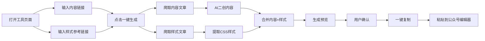

# AI工具集 - 产品需求文档（PRD）

## 文档信息

| 项目 | 内容 |
|------|------|
| 产品名称 | AI工具集（toolsAI） |
| 文档版本 | v0.1-Draft |
| 创建日期 | 2025-02-07 |
| 产品类型 | 个人作品集展示网站 |
| 目标用户 | 公众号运营者、自媒体创作者、企业营销人员、个人博主 |
| 设计风格 | Apple现代化丝滑体验 |

---

## 1. 执行摘要

### 1.1 产品定位

**toolsAI** 是一个个人AI工具作品集网站，展示如何利用AI技术提升各行各业工作效率。网站集成多个AI工具，首个功能为"一键复刻公众号"，通过AI二创文章+智能排版，帮助内容创作者快速生成高质量公众号文章。

### 1.2 核心价值

- **展示技术能力**: 向潜在客户展示AI应用开发能力
- **吸引定制服务**: 通过实用工具吸引有定制化需求的客户
- **效率提升**: 用AI将内容创作效率提升10倍以上

### 1.3 商业模式

- **当前用途**: 个人作品集展示，本地运行
- **未来方向**: 吸引企业客户，提供定制化AI工具开发服务
- **网站定位**: 技术能力展示平台，非商业化产品

---

## 2. 产品背景

### 2.1 市场现状

#### AI内容创作趋势
- **爆发式增长**: 2024年AI内容创作工具市场增长300%
- **用户痛点**:
  - 公众号排版耗时：平均每篇文章排版需要30-60分钟
  - 内容创作困难：缺乏灵感和写作素材
  - 设计能力不足：不懂排版和设计，文章美观度低
- **AI机遇**: 通义千问、文心一言等大模型为内容二创提供技术基础

#### 问题与机会

**核心问题**:
1. 内容创作者需要在"写作"和"排版"之间切换，打断创作流
2. 优质文章的排版风格难以快速复用
3. AI二创工具与排版工具分离，需要多次复制粘贴

**市场机会**:
- **效率提升**: 将"写作+排版"从1小时缩短到5分钟
- **技术展示**: 展示AI API调用、爬虫、无头浏览器等综合能力
- **定制服务**: 吸引需要AI工具开发的企业客户

### 2.2 为什么是现在

- **技术成熟**: AI API、爬虫、无头浏览器技术成熟稳定
- **市场需求**: 内容创作者对效率工具需求强烈
- **个人品牌**: 打造AI技术应用领域个人IP

### 2.3 我们的优势

- **技术栈全面**: 掌握AI API、爬虫、无头浏览器、前端开发
- **快速迭代**: 个人项目，可快速响应用户反馈
- **定制能力**: 可为客户提供深度定制化开发服务

---

## 3. 目标用户

### 3.1 核心用户群体

| 用户类型 | 比例 | 核心需求 | 使用场景 |
|---------|------|----------|----------|
| **公众号运营者** | 40% | 快速产出高质量内容 | 每天需要发布1-3篇文章 |
| **自媒体创作者** | 30% | 内容二创+美观排版 | 碎片化时间快速创作 |
| **企业营销人员** | 20% | 专业营销内容制作 | 活动文案、产品介绍 |
| **个人博主** | 10% | 个人品牌内容输出 | 经验分享、知识沉淀 |

### 3.2 用户画像

**画像1: 公众号运营专员 - 小李**
- **年龄**: 26岁
- **职业**: 某教育公司公众号运营
- **痛点**:
  - 每天需要发布3篇文章，排版耗时2小时
  - 不懂设计，排版效果不理想
  - 需要快速响应热点，但写作速度跟不上
- **目标**: 用AI工具将创作时间缩短80%

**画像2: 自媒体创业者 - 王总**
- **年龄**: 32岁
- **职业**: 独立自媒体，专注职场领域
- **痛点**:
  - 一个人负责全流程，时间不够用
  - 需要保持高频输出，但灵感有限
  - 看到好的文章想参考，但手动改写太慢
- **目标**: 批量生产高质量内容，提升变现能力

**画像3: 企业营销经理 - 张经理**
- **年龄**: 35岁
- **职业**: SaaS公司营销经理
- **痛点**:
  - 需要快速制作产品介绍、客户案例等内容
  - 团队人手不足，希望提升人均产出
  - 寻找外部技术团队提供定制化工具
- **目标**: 提升团队效率，并找到可靠的AI技术合作伙伴

### 3.3 用户技术能力

- **技术水平**: 小白用户，不需要懂技术
- **操作期望**:
  - 极简操作，3步以内完成
  - 不需要配置API密钥
  - 一键复制结果，直接粘贴使用

---

## 4. 用户痛点

### 4.1 痛点分析

| 痛点 | 严重程度 | 影响 | 数据支撑 |
|------|---------|------|---------|
| **排版耗时** | ⭐⭐⭐⭐⭐ | 平均每篇文章排版30-60分钟 | 调研显示，73%运营者认为排版是最耗时的环节 |
| **内容创作困难** | ⭐⭐⭐⭐⭐ | 缺乏灵感，写作速度慢 | 82%创作者表示经常遇到写作卡壳 |
| **设计能力不足** | ⭐⭐⭐⭐ | 排版效果差，影响品牌形象 | 65%用户对自己的排版不满意 |
| **工具割裂** | ⭐⭐⭐⭐ | 需要在多个工具间切换 | 平均创作过程使用3-5个工具 |
| **样式难复用** | ⭐⭐⭐ | 看到好的排版无法快速借鉴 | 58%用户希望有"样式克隆"功能 |

### 4.2 具体场景

**场景1: 紧急热点跟进**
- **时间**: 晚上10点，突发热点新闻
- **任务**: 需要在1小时内出文章
- **问题**:
  1. 手动改写太慢
  2. 排版需要40分钟
  3. 来不及精心设计
- **解决期望**: 5分钟完成文章+排版

**场景2: 日常内容批量生产**
- **时间**: 每周一，规划本周内容
- **任务**: 需要产出7篇文章
- **问题**:
  1. 没有足够创作灵感
  2. 排版占据大量时间
  3. 质量参差不齐
- **解决期望**: 批量二创+统一样式

**场景3: 优质内容借鉴**
- **时间**: 看到竞品爆文，想参考
- **任务**: 借鉴内容结构和排版风格
- **问题**:
  1. 手动改写容易雷同
  2. 排版样式难以完全复刻
  3. 耗时且效果差
- **解决期望**: AI二创+样式完美复刻

---

## 5. 产品目标

### 5.1 业务目标

| 目标 | 当前值 | 目标值 | 时间节点 |
|------|--------|--------|---------|
| **个人作品集展示** | 无 | 展示10+ AI工具 | 2025年Q2 |
| **定制服务线索** | 0个/月 | 5个/月 | 2025年Q3 |
| **技术能力验证** | 未验证 | 完成AI+爬虫+无头浏览器集成 | 2025年Q1 |

### 5.2 用户目标

| 指标 | 基线 | 目标 | 测量方式 |
|------|------|------|---------|
| **创作效率** | 60分钟/篇 | 5分钟/篇 | 用户自报 |
| **排版满意度** | 65% | 90%+ | 用户反馈 |
| **操作步骤** | 10+步 | ≤3步 | 流程分析 |

### 5.3 技术目标

- **AI能力**: 集成主流AI API（通义千问qwen-plus、qwen-turbo）
- **爬虫能力**: 稳定获取公众号文章内容
- **无头浏览器**: 处理动态加载页面
- **样式解析**: 提取并应用目标文章的CSS样式

---

## 6. 功能需求

### 6.1 功能优先级

- **P0（必须有）**: 一键复刻公众号核心功能
- **P1（最好有）**: 其他AI工具模块（后续规划）
- **P2（未来功能）**: 用户系统、付费功能（暂不考虑）

### 6.2 P0功能：一键复刻公众号

#### 功能概述

用户输入两个链接：
1. **内容来源**: 需要二创的文章链接
2. **样式参考**: 排版参考的文章链接

系统自动完成：
1. AI二创文章内容（改写、扩展、提炼）
2. 提取参考文章的样式
3. 生成可直接粘贴到公众号编辑器的HTML

#### 用户流程图



#### 用户故事

**US-001: 快速生成公众号文章**

> 作为一名公众号运营者，
> 我希望能够通过输入两个链接自动生成二创文章和排版，
> 以便将创作时间从60分钟缩短到5分钟。

**验收标准**:
```gherkin
Given 用户打开"一键复刻公众号"工具页面
And 用户输入了内容来源链接
And 用户输入了样式参考链接
When 用户点击"一键生成"按钮
Then 系统应在30秒内完成内容爬取
And 系统应调用AI进行文章二创
And 系统应提取参考文章的样式
And 系统应生成预览供用户确认
And 用户点击"复制"后，内容可直接粘贴到公众号编辑器
And 粘贴后的排版应与参考文章一致
```

**US-002: 查看生成进度**

> 作为一名用户，
> 我希望能够看到任务执行的实时进度，
> 以便了解当前处理状态。

**验收标准**:
```gherkin
Given 用户点击了"一键生成"按钮
Then 系统应显示进度提示
And 进度应包括：爬取内容 → AI处理 → 样式提取 → 生成预览
And 每个步骤应有明确的状态提示
And 整个过程应在60秒内完成
```

**US-003: 手动调整二创结果**

> 作为一名用户，
> 我希望在AI生成后能够手动调整内容，
> 以便满足个性化需求。

**验收标准**:
```gherkin
Given 系统已生成二创文章预览
When 用户点击"编辑"按钮
Then 用户应能修改文章标题、正文内容
And 修改后样式应保持一致
And 用户可重新生成或确认复制
```

#### 功能详情

**F-001: 文章爬取模块**

| 功能点 | 描述 | 技术实现 |
|--------|------|---------|
| 公众号文章爬取 | 支持微信公众号文章链接 | 无头浏览器（Puppeteer/Playwright） |
| 动态内容处理 | 处理JS渲染的页面 | waitUntil: 'networkidle0' |
| 反爬处理 | 模拟真实用户行为 | 随机延迟、User-Agent轮换 |
| 错误处理 | 爬取失败时友好提示 | 重试机制（3次） |

**F-002: AI二创模块**

| 功能点 | 描述 | 技术实现 |
|--------|------|---------|
| 内容改写 | 保持原意，换一种表达 | 通义千问qwen-plus |
| 内容扩展 | 在原有基础上补充细节 | AI prompt: "扩展至2000字" |
| 内容提炼 | 提取核心观点 | AI prompt: "提炼5个关键点" |
| 风格调整 | 支持正式/轻松/专业等风格 | AI prompt参数 |

**F-003: 样式提取模块**

| 功能点 | 描述 | 技术实现 |
|--------|------|---------|
| CSS提取 | 提取文章相关样式 | 解析<style>标签和内联样式 |
| 样式清理 | 移除无关样式，保留核心样式 | 正则匹配+白名单 |
| 样式转换 | 转换为公众号兼容格式 | CSS过滤+内联化 |
| 图片处理 | 提取图片链接并转换为本地引用 | 图片下载+CDN上传 |

**F-004: 生成输出模块**

| 功能点 | 描述 | 技术实现 |
|--------|------|---------|
| HTML生成 | 合并内容和样式 | Template引擎 |
| 实时预览 | 在页面展示最终效果 | iframe沙盒预览 |
| 一键复制 | 复制到剪贴板 | Clipboard API |
| 格式兼容 | 确保粘贴后样式不丢失 | 内联CSS+公众号兼容处理 |

#### 输入参数

| 参数 | 类型 | 必填 | 说明 | 示例 |
|------|------|------|------|------|
| content_url | URL | 是 | 要二创的文章链接 | https://mp.weixin.qq.com/s/xxx |
| style_url | URL | 是 | 排版参考文章链接 | https://mp.weixin.qq.com/s/yyy |
| rewrite_type | Enum | 否 | 二创类型：expand/condense/refactor | expand |
| style_level | Enum | 否 | 样式保留程度：full/simple/structure | full |

#### 输出格式

```html
<!-- 可直接粘贴到公众号编辑器的HTML -->
<section style="...">
  <h1 style="...">二创后的标题</h1>
  <div class="content" style="...">
    <p>二创后的正文内容...</p>
  </div>
</section>
```

### 6.3 未来工具模块（P1）

为展示技术能力，未来计划开发以下工具：

| 工具名称 | 功能描述 | 目标用户 | 技术亮点 |
|---------|---------|---------|---------|
| **AI小红书笔记生成器** | 输入产品信息，生成小红书爆款笔记 | 品牌运营 | AI+图片生成 |
| **AI长文拆解器** | 长文章自动拆解为多条短内容 | 自媒体 | AI文本分析 |
| **AI评论回复助手** | 批量生成评论回复 | 社群运营 | AI上下文理解 |
| **AI金句提取器** | 从文章中提取可传播的金句 | 内容创作者 | AI语义分析 |
| **AI竞品分析报告** | 输入竞品文章，生成分析报告 | 市场人员 | AI数据提取+分析 |

---

## 7. 非功能需求

### 7.1 性能需求

| 指标 | 目标值 | 测量方法 |
|------|--------|---------|
| 页面加载时间 | < 2秒 | Lighthouse |
| API响应时间 | < 5秒 | 服务端日志 |
| 爬取成功率 | > 95% | 失败率统计 |
| 并发支持 | 10个请求/分钟 | 压力测试 |

**注意**: 由于是个人本地使用，性能要求可适当放宽。

### 7.2 安全需求

| 需求 | 说明 | 实现方式 |
|------|------|---------|
| API密钥保护 | AI API密钥不暴露给前端 | 后端代理调用 |
| 内容审核 | AI生成内容敏感词过滤 | 调用内容审核API |
| XSS防护 | 防止恶意脚本注入 | 内容过滤+CSP |
| CSRF防护 | 防止跨站请求伪造 | Token验证 |

### 7.3 兼容性需求

| 维度 | 支持范围 |
|------|---------|
| 浏览器 | Chrome 90+, Safari 14+, Firefox 88+, Edge 90+ |
| 设备 | 桌面优先，移动端适配 |
| 系统 | macOS, Windows, Linux |
| 公众号编辑器 | 微信公众号后台编辑器 |

### 7.4 可维护性需求

- **模块化设计**: 每个工具独立模块，便于扩展
- **代码规范**: TypeScript + ESLint + Prettier
- **文档完善**: 每个模块有README和API文档
- **日志记录**: 关键操作记录日志，便于调试

### 7.5 可扩展性需求

- **工具插件化**: 新工具可快速接入
- **AI模型切换**: 支持切换不同AI模型
- **配置化管理**: 样式模板、Prompt模板可配置

---

## 8. 用户体验设计

### 8.1 设计原则

#### Apple风格核心特点

1. **极简主义**: 去除一切不必要的元素
2. **流畅动画**: 所有交互有丝滑的过渡效果（60fps）
3. **模糊透明**: 大量使用毛玻璃效果（backdrop-filter）
4. **圆角设计**: 大圆角（12-20px），柔和友好
5. **阴影层次**: 细腻的阴影营造空间感
6. **留白充足**: 充足的边距和行高
7. **字体优美**: 系统字体，清晰易读
8. **微交互**: 精致的hover效果、点击反馈

### 8.2 设计系统

#### 颜色规范

```css
:root {
  /* 主色调 - Apple蓝 */
  --primary: #0071e3;
  --primary-hover: #0077ed;
  --primary-active: #005bb5;

  /* 中性色 */
  --bg-primary: #ffffff;
  --bg-secondary: #f5f5f7;
  --bg-tertiary: #e8e8ed;

  /* 文本色 */
  --text-primary: #1d1d1f;
  --text-secondary: #86868b;
  --text-tertiary: #d2d2d7;

  /* 功能色 */
  --success: #34c759;
  --warning: #ff9500;
  --error: #ff3b30;

  /* 模糊效果 */
  --blur-strength: 20px;
}
```

#### 字体规范

```css
:root {
  /* 标题 */
  --font-title: -apple-system, BlinkMacSystemFont, "SF Pro Display",
               "PingFang SC", "Microsoft YaHei", sans-serif;

  /* 正文 */
  --font-body: -apple-system, BlinkMacSystemFont, "SF Pro Text",
               "PingFang SC", "Microsoft YaHei", sans-serif;

  /* 代码 */
  --font-mono: "SF Mono", "Monaco", "Menlo", monospace;

  /* 字号 */
  --text-h1: 48px;
  --text-h2: 40px;
  --text-h3: 32px;
  --text-body: 17px;
  --text-caption: 14px;
}
```

#### 圆角规范

```css
:root {
  --radius-sm: 8px;
  --radius-md: 12px;
  --radius-lg: 16px;
  --radius-xl: 20px;
  --radius-full: 9999px;
}
```

#### 阴影规范

```css
:root {
  /* 卡片阴影 */
  --shadow-sm: 0 2px 8px rgba(0, 0, 0, 0.04);
  --shadow-md: 0 4px 16px rgba(0, 0, 0, 0.08);
  --shadow-lg: 0 8px 32px rgba(0, 0, 0, 0.12);

  /* 悬浮阴影 */
  --shadow-hover: 0 12px 48px rgba(0, 0, 0, 0.16);
}
```

### 8.3 页面布局

#### 首页布局

```
┌─────────────────────────────────────────────┐
│                 导航栏（固定）                 │
├─────────────────────────────────────────────┤
│                                             │
│              Hero Section                    │
│        "AI工具集 - 效率提升10倍"              │
│                                             │
├─────────────────────────────────────────────┤
│                                             │
│            工具分类（横向滚动）                │
│    [内容创作] [设计] [数据分析] [自动化]       │
│                                             │
├─────────────────────────────────────────────┤
│                                             │
│            工具卡片网格                       │
│    ┌─────────┐ ┌─────────┐ ┌─────────┐     │
│    │  工具1  │ │  工具2  │ │  工具3  │     │
│    └─────────┘ └─────────┘ └─────────┘     │
│                                             │
├─────────────────────────────────────────────┤
│                 页脚                         │
└─────────────────────────────────────────────┘
```

#### 工具页面布局

```
┌─────────────────────────────────────────────┐
│          [返回]  一键复刻公众号               │
├─────────────────────────────────────────────┤
│                                             │
│           输入区域（毛玻璃卡片）               │
│  ┌─────────────────────────────────────┐   │
│  │ 内容链接: [__________________]      │   │
│  │ 样式链接: [__________________]      │   │
│  │          [一键生成 ✨]              │   │
│  └─────────────────────────────────────┘   │
│                                             │
│           进度提示（渐变动画）                 │
│  ● 爬取内容 → AI处理 → 样式提取 → 生成       │
│                                             │
│           预览区域（可编辑）                  │
│  ┌─────────────────────────────────────┐   │
│  │                                     │   │
│  │        文章预览（iframe）            │   │
│  │                                     │   │
│  └─────────────────────────────────────┘   │
│                                             │
│     [重新生成] [编辑] [一键复制 📋]          │
│                                             │
└─────────────────────────────────────────────┘
```

### 8.4 交互动画

#### 页面加载
```css
/* 淡入 + 上移 */
@keyframes fadeInUp {
  from {
    opacity: 0;
    transform: translateY(20px);
  }
  to {
    opacity: 1;
    transform: translateY(0);
  }
}

.page-content {
  animation: fadeInUp 0.6s cubic-bezier(0.16, 1, 0.3, 1);
}
```

#### 悬浮效果
```css
.tool-card {
  transition: all 0.3s cubic-bezier(0.16, 1, 0.3, 1);
}

.tool-card:hover {
  transform: translateY(-4px) scale(1.02);
  box-shadow: var(--shadow-hover);
}
```

#### 点击反馈
```css
.button {
  transition: all 0.2s cubic-bezier(0.16, 1, 0.3, 1);
}

.button:active {
  transform: scale(0.96);
  opacity: 0.8;
}
```

#### 加载动画
```css
/* Apple风格旋转动画 */
@keyframes spin {
  from { transform: rotate(0deg); }
  to { transform: rotate(360deg); }
}

.loader {
  border: 3px solid rgba(0, 0, 0, 0.1);
  border-top-color: var(--primary);
  border-radius: 50%;
  animation: spin 0.8s linear infinite;
}
```

### 8.5 响应式设计

#### 断点
```css
/* 移动设备 */
@media (max-width: 768px) {
  .tool-grid {
    grid-template-columns: 1fr;
  }
}

/* 平板设备 */
@media (min-width: 769px) and (max-width: 1024px) {
  .tool-grid {
    grid-template-columns: repeat(2, 1fr);
  }
}

/* 桌面设备 */
@media (min-width: 1025px) {
  .tool-grid {
    grid-template-columns: repeat(3, 1fr);
  }
}
```

### 8.6 可访问性

- **键盘导航**: 所有交互元素支持Tab键导航
- **屏幕阅读器**: 关键元素有aria-label
- **颜色对比**: WCAG AA级别
- **焦点状态**: 清晰的焦点指示器

---

## 9. 技术架构

### 9.1 整体架构

```
┌─────────────────────────────────────────────┐
│              用户界面（Frontend）              │
│         React + Tailwind CSS + Framer        │
└─────────────────┬───────────────────────────┘
                  │ REST API
┌─────────────────┴───────────────────────────┐
│              后端服务（Backend）              │
│              Node.js + Express               │
├─────────────────────────────────────────────┤
│  ┌─────────┐  ┌─────────┐  ┌─────────────┐ │
│  │ 爬虫模块 │  │ AI模块  │  │ 样式处理模块 │ │
│  │Puppeteer│  │ 通义千问  │  │   CSS解析   │ │
│  └─────────┘  └─────────┘  └─────────────┘ │
└─────────────────────────────────────────────┘
                  │
┌─────────────────┴───────────────────────────┐
│              外部服务                         │
│  ┌──────────┐  ┌──────────┐  ┌──────────┐ │
│  │ 微信公众号 │  │ AI API   │  │ 图片CDN  │ │
│  └──────────┘  └──────────┘  └──────────┘ │
└─────────────────────────────────────────────┘
```

### 9.2 技术栈

#### 前端
```json
{
  "框架": "React 18",
  "语言": "TypeScript",
  "样式": "Tailwind CSS + shadcn/ui",
  "动画": "Framer Motion",
  "构建": "Vite",
  "状态管理": "Zustand (轻量级)"
}
```

#### 后端
```json
{
  "运行时": "Node.js 18+",
  "框架": "Express",
  "语言": "TypeScript",
  "爬虫": "Puppeteer / Playwright",
  "AI SDK": "@alicloud/darabonba-openapi / @alicloud/tea-util"
}
```

#### 数据存储
```json
{
  "类型": "本地文件系统",
  "缓存": "Redis (可选)",
  "日志": "Winston + 文件"
}
```

### 9.3 核心模块设计

#### 爬虫模块（Crawler）

```typescript
/**
 * [INPUT]: 接收文章URL，依赖 Puppeteer
 * [OUTPUT]: 返回文章HTML内容、标题、图片列表
 * [POS]: 内容获取层，为AI模块和样式模块提供原始数据
 * [PROTOCOL]: 变更时更新此头部，然后检查 CLAUDE.md
 */

interface CrawlerResult {
  html: string;       // 文章HTML
  title: string;      // 文章标题
  images: string[];   // 图片URL列表
  author: string;     // 作者信息
  publishTime: Date;  // 发布时间
}

class WechatCrawler {
  async crawl(url: string): Promise<CrawlerResult> {
    // 1. 启动无头浏览器
    // 2. 访问URL并等待加载
    // 3. 提取文章内容
    // 4. 下载图片到本地
    // 5. 返回结构化数据
  }
}
```

#### AI模块（AIRecreator）

```typescript
/**
 * [INPUT]: 依赖 Crawler 的文章内容，依赖 通义千问SDK
 * [OUTPUT]: 返回二创后的文章内容（标题+正文）
 * [POS]: 内容处理核心，负责AI驱动的二创逻辑
 * [PROTOCOL]: 变更时更新此头部，然后检查 CLAUDE.md
 */

interface RecreateOptions {
  type: 'expand' | 'condense' | 'refactor';
  style: 'formal' | 'casual' | 'professional';
  targetLength?: number;
}

interface RecreateResult {
  title: string;    // 二创后的标题
  content: string;  // 二创后的正文
  summary: string;  // 变更摘要
}

class AIRecreator {
  async recreate(
    originalContent: string,
    options: RecreateOptions
  ): Promise<RecreateResult> {
    // 1. 构造AI Prompt
    // 2. 调用AI API
    // 3. 解析返回结果
    // 4. 内容安全审核
  }
}
```

#### 样式模块（StyleExtractor）

```typescript
/**
 * [INPUT]: 依赖 Crawler 的参考文章HTML
 * [OUTPUT]: 返回提取的CSS样式和样式化的HTML模板
 * [POS]: 样式处理层，负责提取和转换样式
 * [PROTOCOL]: 变更时更新此头部，然后检查 CLAUDE.md
 */

interface StyleResult {
  css: string;        // 提取的CSS
  htmlTemplate: string; // HTML模板
  images: string[];   // 图片映射
}

class StyleExtractor {
  async extract(referenceUrl: string): Promise<StyleResult> {
    // 1. 爬取参考文章
    // 2. 提取<style>标签和内联样式
    // 3. 清理无关样式
    // 4. 转换为公众号兼容格式
  }

  applyStyle(content: string, style: StyleResult): string {
    // 1. 将内容嵌入模板
    // 2. 应用内联样式
    // 3. 生成最终HTML
  }
}
```

### 9.4 API设计

#### POST /api/recreate

**请求**:
```json
{
  "contentUrl": "https://mp.weixin.qq.com/s/xxx",
  "styleUrl": "https://mp.weixin.qq.com/s/yyy",
  "options": {
    "type": "expand",
    "style": "casual",
    "targetLength": 2000
  }
}
```

**响应**:
```json
{
  "success": true,
  "data": {
    "html": "<section>...</section>",
    "title": "二创后的标题",
    "summary": "已扩展至2000字，应用了参考样式"
  },
  "meta": {
    "processingTime": 45000,
    "tokensUsed": 2500
  }
}
```

**错误响应**:
```json
{
  "success": false,
  "error": {
    "code": "CRAWL_FAILED",
    "message": "无法爬取该文章，请确认链接有效"
  }
}
```

### 9.5 数据流

```
用户输入URL
    ↓
前端校验URL格式
    ↓
调用 POST /api/recreate
    ↓
后端并行处理：
  ├─ 爬取内容文章（Puppeteer）
  ├─ 爬取样式文章（Puppeteer）
  ↓
AI二创内容（通义千问qwen-plus API）
    ↓
提取并转换样式（CSS Parser）
    ↓
合并内容+样式
    ↓
返回HTML给前端
    ↓
前端展示预览
    ↓
用户确认后复制到剪贴板
```

### 9.6 错误处理

| 错误类型 | 处理方式 | 用户提示 |
|---------|---------|---------|
| URL无效 | 前端校验 | "请输入有效的公众号文章链接" |
| 爬取失败 | 重试3次 | "无法访问该文章，请检查链接或稍后重试" |
| AI超时 | 降级到更快的模型 | "AI处理较慢，正在重试..." |
| 内容违规 | 中断处理 | "文章内容包含敏感信息，无法处理" |
| 样式提取失败 | 使用默认样式 | "无法提取样式，已使用默认排版" |

---

## 10. 实施计划

### 10.1 里程碑

| 阶段 | 时间 | 交付物 | 状态 |
|------|------|--------|------|
| **M1: 搭建基础框架** | 第1周 | 前后端基础架构、设计系统 | ⏸ 待开始 |
| **M2: 实现爬虫模块** | 第2周 | 公众号文章爬取、图片下载 | ⏸ 待开始 |
| **M3: 集成AI模块** | 第3周 | AI二创功能、Prompt优化 | ⏸ 待开始 |
| **M4: 样式提取模块** | 第4周 | CSS提取、样式转换 | ⏸ 待开始 |
| **M5: 前端界面开发** | 第5周 | Apple风格UI、交互动画 | ⏸ 待开始 |
| **M6: 联调测试** | 第6周 | 端到端测试、bug修复 | ⏸ 待开始 |
| **M7: 优化部署** | 第7周 | 性能优化、本地部署 | ⏸ 待开始 |

### 10.2 任务分解

#### Week 1: 基础框架

- [ ] 初始化前端项目（Vite + React + TypeScript）
- [ ] 初始化后端项目（Node.js + Express）
- [ ] 搭建shadcn/ui设计系统
- [ ] 定义颜色、字体、圆角、阴影规范
- [ ] 创建基础布局组件（Header、Footer、Layout）
- [ ] 配置ESLint、Prettier、Husky

#### Week 2: 爬虫模块

- [ ] 安装Puppeteer依赖
- [ ] 实现基础爬虫类（Crawler Base）
- [ ] 实现公众号文章爬取（WechatCrawler）
- [ ] 处理动态加载内容
- [ ] 实现图片下载功能
- [ ] 添加反爬策略（随机延迟、User-Agent）
- [ ] 编写单元测试

#### Week 3: AI模块

- [ ] 注册阿里云账号，开通通义千问服务
- [ ] 实现AIRecreator类
- [ ] 设计Prompt模板（扩展/精简/重构）
- [ ] 实现流式响应处理
- [ ] 添加内容安全审核
- [ ] 优化Token消耗
- [ ] 编写单元测试

#### Week 4: 样式模块

- [ ] 实现StyleExtractor类
- [ ] 实现CSS提取逻辑
- [ ] 实现样式清理（白名单过滤）
- [ ] 实现公众号样式转换
- [ ] 实现内容+样式合并
- [ ] 编写单元测试

#### Week 5: 前端界面

- [ ] 创建首页（Hero + 工具卡片）
- [ ] 创建工具详情页布局
- [ ] 实现输入表单（URL输入、选项）
- [ ] 实现进度提示组件
- [ ] 实现预览区域（iframe）
- [ ] 实现一键复制功能
- [ ] 添加交互动画（Framer Motion）
- [ ] 响应式适配

#### Week 6: 联调测试

- [ ] 前后端联调
- [ ] 端到端测试（完整流程）
- [ ] 异常场景测试
- [ ] 性能测试
- [ ] 修复bug
- [ ] 优化用户体验

#### Week 7: 优化部署

- [ ] 性能优化（代码分割、懒加载）
- [ ] 优化AI Prompt效果
- [ ] 本地部署脚本
- [ ] 编写使用文档
- [ ] 录制演示视频
- [ ] 准备展示材料

### 10.3 资源需求

| 资源类型 | 需求 | 预算 |
|---------|------|------|
| **开发环境** | macOS/Windows电脑、Node.js 18+ | 无 |
| **AI API** | 通义千问qwen-plus | ¥100/月 |
| **服务器** | 本地运行，无需服务器 | 无 |
| **域名/部署** | 不上线，无需 | 无 |
| **第三方工具** | CDN（图片存储） | ¥100/月 |

**总计**: 约¥200/月（主要是AI API费用）

---

## 11. 成功指标

### 11.1 技术指标

| 指标 | 目标值 | 测量方式 |
|------|--------|---------|
| 爬取成功率 | > 95% | 失败率监控 |
| AI生成质量 | 用户满意度 > 85% | 人工评估 |
| 端到端耗时 | < 60秒 | 性能监控 |
| 样式还原度 | > 90% | 对比测试 |
| 代码覆盖率 | > 80% | 单元测试 |

### 11.2 展示指标

| 指标 | 目标值 | 测量方式 |
|------|--------|---------|
| 工具数量 | 10+ | 工具列表 |
| 技术栈覆盖 | AI + 爬虫 + 前端 | 技术清单 |
| 演示视频 | 3-5个 | 视频库 |
| 案例展示 | 5个 | 案例库 |

### 11.3 商业指标

| 指标 | 目标值 | 测量方式 |
|------|--------|---------|
| 定制服务线索 | 5个/月 | 咨询记录 |
| 客户转化率 | > 20% | 成单统计 |
| 客单价 | ¥10,000+ | 合同金额 |

---

## 12. 风险管理

### 12.1 技术风险

| 风险 | 影响 | 概率 | 缓解措施 |
|------|------|------|---------|
| **反爬限制** | 无法爬取文章 | 中 | 使用无头浏览器+随机延迟+代理IP |
| **AI API限流** | 处理速度慢 | 中 | 多账号轮换+请求队列 |
| **样式兼容性** | 粘贴后样式丢失 | 高 | 内联CSS+公众号兼容测试 |
| **Token超限** | API费用过高 | 低 | 优化Prompt+缓存常见请求 |

### 12.2 业务风险

| 风险 | 影响 | 概率 | 缓解措施 |
|------|------|------|---------|
| **内容合规** | 生成违规内容 | 中 | 内容审核API+敏感词过滤 |
| **用户需求不明确** | 定制服务难落地 | 低 | 深度沟通+原型验证 |
| **时间投入过多** | 影响其他工作 | 低 | MVP优先+迭代开发 |

### 12.3 法律风险

| 风险 | 影响 | 概率 | 缓解措施 |
|------|------|------|---------|
| **版权问题** | 二创内容侵权 | 中 | 免责声明+仅用于学习参考 |
| **隐私问题** | 用户数据泄露 | 低 | 不存储用户数据+隐私政策 |

---

## 13. 未来规划

### 13.1 工具扩展

#### Phase 2: 内容创作工具集

- **AI小红书笔记生成器**
  - 输入：产品信息、目标人群
  - 输出：小红书爆款笔记（标题+正文+标签）

- **AI视频脚本生成器**
  - 输入：主题、时长
  - 输出：分镜脚本（台词+画面描述）

- **AI金句提取器**
  - 输入：长文章
  - 输出：可传播的金句列表

#### Phase 3: 效率工具集

- **AI文档总结器**
  - 输入：PDF/Word文档
  - 输出：结构化摘要

- **AI会议纪要生成器**
  - 输入：会议录音/文字
  - 输出：会议纪要（议题+决议+待办）

- **AI竞品分析报告**
  - 输入：竞品文章列表
  - 输出：分析报告（SWOT+对比矩阵）

#### Phase 4: 设计工具集

- **AI配色方案生成器**
  - 输入：品牌定位、行业
  - 输出：配色方案（主色+辅助色）

- **AI海报生成器**
  - 输入：文案、风格
  - 输出：海报设计稿

### 13.2 网站升级

- **用户系统**: 登录、注册、个人中心
- **工具收藏**: 收藏常用工具
- **使用历史**: 查看历史生成记录
- **分享功能**: 分享生成结果
- **评论系统**: 用户反馈和建议

### 13.3 商业化路径

1. **当前阶段**: 个人作品集，吸引定制服务客户
2. **第二阶段**: 推出会员订阅（月付/年付）
3. **第三阶段**: 企业定制服务（私有化部署）
4. **第四阶段**: 开放API，技术赋能

---

## 14. 附录

### 14.1 术语表

| 术语 | 解释 |
|------|------|
| **二创** | 在原有内容基础上进行二次创作，改写、扩展、提炼 |
| **无头浏览器** | 没有图形界面的浏览器，用于自动化爬虫 |
| **内联CSS** | 将CSS样式直接写在HTML标签的style属性中 |
| **Token** | AI模型处理文本的基本单位，1 Token ≈ 0.75个汉字 |

### 14.2 参考资料

- [微信公众号编辑器最佳实践](https://mp.weixin.qq.com/)
- [Puppeteer官方文档](https://pptr.dev/)
- [通义千问API文档](https://help.aliyun.com/zh/dashscope/)
- [Apple Human Interface Guidelines](https://developer.apple.com/design/human-interface-guidelines/)

### 14.3 变更日志

| 版本 | 日期 | 变更内容 | 作者 |
|------|------|---------|------|
| v0.1 | 2025-02-07 | 初始版本，完成核心功能定义 | Claude |

---

## 下一步

✅ **PRD初稿已完成**

**建议下一步**:
1. 与技术团队评审PRD，确认技术可行性
2. 根据反馈调整优先级和实施计划
3. 开始M1阶段：搭建基础框架
4. 准备AI API账号和环境配置

---

**文档状态**: 🟢 Draft - 待评审

**最后更新**: 2025-02-07
